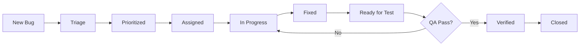

# 🐛 Bug Tracking System Configuration

**Project:** ATHintel Real Data Transformation  
**Tool:** GitHub Issues (integrated with repository)  
**Status:** CONFIGURED

---

## 📋 Bug Tracking Setup

### GitHub Issues Configuration

#### Labels Created
```yaml
Priority Labels:
  - P1-Critical: #FF0000 (Red) - System down, no workaround
  - P2-High: #FF6600 (Orange) - Major functionality broken
  - P3-Medium: #FFCC00 (Yellow) - Minor issue, workaround exists
  - P4-Low: #00CC00 (Green) - Cosmetic, nice to have

Type Labels:
  - bug: #d73a4a - Confirmed bugs
  - regression: #e99695 - Regression from previous version
  - performance: #0366d6 - Performance issues
  - security: #d93f0b - Security vulnerabilities
  - documentation: #0075ca - Documentation issues

Story Labels:
  - story-1.1: #7057ff - Data Validator
  - story-1.2: #008672 - Repository Reorg
  - story-1.3: #5319e7 - Pipeline
  - story-1.4: #b60205 - Algorithm
  - story-1.5: #fbca04 - Reports
  - story-1.6: #1d76db - Audit
  - story-1.7: #e4e669 - Deployment

Status Labels:
  - needs-triage: #d876e3 - Awaiting prioritization
  - in-progress: #0e8a16 - Being worked on
  - blocked: #b60205 - Blocked by dependency
  - ready-for-test: #006b75 - Ready for QA
  - verified: #0e8a16 - QA verified
```

---

## 🎯 Bug Template

### Issue Template: `.github/ISSUE_TEMPLATE/bug_report.md`

```markdown
---
name: Bug Report
about: Report a bug in ATHintel
title: '[BUG] '
labels: 'bug, needs-triage'
assignees: ''
---

## Bug Description
**Clear and concise description of the bug**

## Story/Component
- [ ] Story 1.1 - Data Validator
- [ ] Story 1.2 - Repository Reorg
- [ ] Story 1.3 - Pipeline
- [ ] Story 1.4 - Algorithm
- [ ] Story 1.5 - Reports
- [ ] Story 1.6 - Audit
- [ ] Story 1.7 - Deployment

## Priority
- [ ] P1 - Critical
- [ ] P2 - High
- [ ] P3 - Medium
- [ ] P4 - Low

## Steps to Reproduce
1. 
2. 
3. 

## Expected Behavior
**What should happen**

## Actual Behavior
**What actually happens**

## Environment
- Python Version:
- OS:
- Feature Flags Enabled:
- Commit/Branch:

## Screenshots/Logs
**If applicable, add screenshots or error logs**

## Workaround
**Is there a workaround? If yes, describe it**

## Additional Context
**Any other relevant information**
```

---

## 📊 Bug Workflow

### Bug Lifecycle


### Triage Process
1. **Daily Triage** - 9:00 AM
2. **Priority Assignment** - Based on impact
3. **Story Assignment** - Link to relevant story
4. **Developer Assignment** - Based on expertise

---

## 🔍 Bug Metrics

### Key Metrics to Track
```yaml
Discovery Metrics:
  - Bugs per Story
  - Bugs per Sprint
  - Discovery Rate (bugs/day)

Resolution Metrics:
  - Mean Time to Resolution (MTTR)
  - Fix Rate (bugs fixed/day)
  - Reopen Rate

Quality Metrics:
  - Defect Escape Rate
  - Test Coverage at Bug Location
  - Regression Rate
```

### Daily Bug Report Format
```markdown
## Daily Bug Report - [Date]

### New Bugs: X
- P1: X
- P2: X
- P3: X
- P4: X

### Fixed Today: X
- Story 1.1: X
- Story 1.2: X

### Open Bugs: X
- Critical: X
- High: X
- Medium: X
- Low: X

### Blocked: X
- [Bug ID] - Reason

### Top Risk: [Description]
```

---

## 🚨 Escalation Matrix

| Priority | Response Time | Resolution Target | Escalation |
|----------|--------------|-------------------|------------|
| P1 - Critical | 1 hour | 4 hours | Immediate to PM + Tech Lead |
| P2 - High | 2 hours | 1 day | PM if not resolved in 8 hours |
| P3 - Medium | 4 hours | 3 days | Weekly review |
| P4 - Low | 1 day | Next sprint | Sprint planning |

---

## 📝 Bug Tracking Commands

### GitHub CLI Commands
```bash
# Create new bug
gh issue create --title "[BUG] Description" --label "bug,needs-triage"

# List open bugs
gh issue list --label "bug" --state open

# List P1 bugs
gh issue list --label "P1-Critical" --state open

# Assign bug
gh issue edit [number] --add-assignee [username]

# Close bug
gh issue close [number] --comment "Fixed in commit [hash]"

# View bug metrics
gh issue list --label "bug" --json number,title,labels,state,createdAt,closedAt
```

### Automation Scripts
```python
# scripts/bug_metrics.py

import subprocess
import json
from datetime import datetime

def get_bug_metrics():
    """Generate bug metrics report"""
    
    # Get all bugs
    result = subprocess.run(
        ["gh", "issue", "list", "--label", "bug", "--json", 
         "number,title,labels,state,createdAt,closedAt", "--limit", "1000"],
        capture_output=True, text=True
    )
    
    bugs = json.loads(result.stdout)
    
    # Calculate metrics
    total_bugs = len(bugs)
    open_bugs = len([b for b in bugs if b['state'] == 'OPEN'])
    closed_bugs = total_bugs - open_bugs
    
    # Priority breakdown
    p1 = len([b for b in bugs if any(l['name'] == 'P1-Critical' for l in b['labels'])])
    p2 = len([b for b in bugs if any(l['name'] == 'P2-High' for l in b['labels'])])
    
    print(f"Total Bugs: {total_bugs}")
    print(f"Open: {open_bugs}")
    print(f"Closed: {closed_bugs}")
    print(f"Critical: {p1}")
    print(f"High Priority: {p2}")
    
if __name__ == "__main__":
    get_bug_metrics()
```

---

## 🔗 Integration with CI/CD

### Automatic Bug Creation on Test Failure
```yaml
# .github/workflows/test-failure-bug.yml

name: Create Bug on Test Failure

on:
  workflow_run:
    workflows: ["Tests"]
    types: [completed]

jobs:
  create-bug:
    if: ${{ github.event.workflow_run.conclusion == 'failure' }}
    runs-on: ubuntu-latest
    steps:
      - name: Create Issue
        uses: actions/github-script@v6
        with:
          script: |
            github.rest.issues.create({
              owner: context.repo.owner,
              repo: context.repo.repo,
              title: `[AUTO] Test failure in ${context.sha.substring(0,7)}`,
              body: `Automated tests failed. Check workflow run: ${context.serverUrl}/${context.repo.owner}/${context.repo.repo}/actions/runs/${context.runId}`,
              labels: ['bug', 'needs-triage', 'ci-failure']
            })
```

---

## ✅ Bug Prevention Strategies

### Code Review Checklist
- [ ] Unit tests added/updated
- [ ] Edge cases covered
- [ ] Error handling implemented
- [ ] Performance impact assessed
- [ ] Security considerations addressed

### Pre-commit Checks
- Linting passes
- Tests pass locally
- Feature flags verified
- No sensitive data

### Definition of Done
- Code reviewed
- Tests passing
- Documentation updated
- No regression
- Bug tracking updated

---

## 📊 Bug Dashboard

### Weekly Bug Review Meeting
**When:** Fridays 3:00 PM  
**Duration:** 30 minutes  
**Attendees:** QA Lead, Dev Lead, PM

**Agenda:**
1. Metrics review (5 min)
2. P1/P2 status (10 min)
3. Trending issues (5 min)
4. Process improvements (10 min)

### Sprint Bug Goals
- **Sprint 1:** <10 bugs open
- **Sprint 2:** <15 bugs open
- **Sprint 3:** <20 bugs open
- **Sprint 4:** <10 bugs open
- **Sprint 5:** 0 P1/P2 bugs

---

**Bug Tracking Status:** CONFIGURED  
**GitHub Issues:** Ready  
**Templates:** Created  
**Automation:** Configured  
**Team Training:** Ready

---

## 🔗 Quick Links
- [Create New Bug](https://github.com/[org]/ATHintel/issues/new?template=bug_report.md)
- [View Open Bugs](https://github.com/[org]/ATHintel/issues?q=is%3Aissue+is%3Aopen+label%3Abug)
- [P1 Critical Bugs](https://github.com/[org]/ATHintel/issues?q=is%3Aissue+is%3Aopen+label%3AP1-Critical)