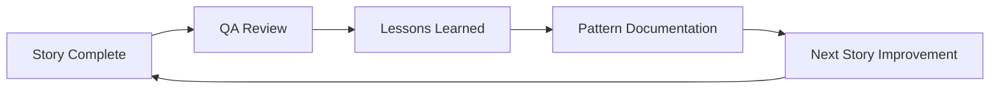

# 🎯 QA Best Practices Implementation Guide - ATHintel

## Executive Action Plan

### 🚨 **Immediate Actions Required (Week 0)**

Based on the QA assessment, these must be completed BEFORE development starts:

1. **Feature Flag Infrastructure** 
   ```python
   # config/feature_flags.py
   FEATURES = {
       'data_validation_enabled': False,
       'authenticity_scoring': False,
       'real_data_pipeline': False,
       'audit_logging': False
   }
   ```

2. **40% QA Allocation Staffing**
   - Development: 3 engineers
   - QA: 2 engineers (increased from typical 1)
   - Ratio: 40% QA effort vs 25% standard

3. **Sprint Extension Planning**
   - Original: 4 sprints
   - Revised: 5 sprints (additional stabilization sprint)
   - Sprint 5: Bug fixes, performance tuning, production prep

---

## 1. Early Engagement Framework

### **Shift-Left QA Timeline**

```
Story Drafting → QA Risk/Design → Story Refinement → Development → Testing
     Day 1           Day 2            Day 3          Day 4-8      Day 9-10
```

### **Implementation for Each Story Phase:**

#### During Story Drafting (Day 1)
```markdown
## Story Draft Checklist
- [ ] QA reviews initial requirements
- [ ] Run *risk assessment on draft
- [ ] Identify testability concerns
- [ ] Flag missing acceptance criteria
- [ ] Document regression impact
```

#### During Risk/Design (Day 2)
```markdown
## QA Design Session Output
1. Risk Score: [HIGH/MEDIUM/LOW]
2. Test Approach: [Unit/Integration/E2E]
3. Regression Impact: [List affected areas]
4. Performance Benchmarks: [Specific metrics]
5. Data Requirements: [Test data needs]
```

#### During Refinement (Day 3)
```markdown
## Refinement QA Gates
- [ ] Acceptance criteria testable
- [ ] Edge cases documented
- [ ] NFRs clearly defined
- [ ] Rollback procedure exists
- [ ] Test data identified
```

---

## 2. Risk-Based Testing Prioritization

### **Risk Scoring Matrix Implementation**

| Risk Score | Test Coverage | Automation | Manual Testing | Review Level |
|------------|---------------|------------|----------------|--------------|
| CRITICAL (9-10) | 95% | Mandatory | Extensive | PM + Tech Lead |
| HIGH (7-8) | 90% | Required | Comprehensive | Tech Lead |
| MEDIUM (5-6) | 80% | Recommended | Standard | Senior Dev |
| LOW (1-4) | 70% | Optional | Smoke tests | Peer |

### **Applied to ATHintel Stories:**

```python
# test_priority_config.py
STORY_RISK_SCORES = {
    "1.1_validator": 9,      # CRITICAL - Full automation required
    "1.2_reorg": 5,          # MEDIUM - Basic automation
    "1.3_pipeline": 8,       # HIGH - Comprehensive testing
    "1.4_algorithm": 6,      # MEDIUM - Focus on accuracy
    "1.5_reports": 3,        # LOW - Manual verification OK
    "1.6_audit": 6,          # MEDIUM - Integration focus
    "1.7_deployment": 10     # CRITICAL - Full coverage mandatory
}
```

### **Test Allocation by Risk:**

```python
def allocate_test_effort(risk_score):
    """Calculate test effort based on risk score"""
    if risk_score >= 9:
        return {
            "unit_tests": "3 days",
            "integration": "2 days",
            "e2e": "2 days",
            "performance": "1 day",
            "security": "1 day"
        }
    elif risk_score >= 7:
        return {
            "unit_tests": "2 days",
            "integration": "2 days",
            "e2e": "1 day",
            "performance": "0.5 day"
        }
    # ... continue for other risk levels
```

---

## 3. Brownfield Regression Strategy

### **Special Considerations for Existing System**

#### Regression Test Inventory
```markdown
## Current System Functions to Protect
1. [ ] 75 property dataset processing
2. [ ] JSON data format compatibility
3. [ ] Report generation (6 types)
4. [ ] Analytics engine calculations
5. [ ] Scraper integrations (Spitogatos/XE)
6. [ ] File-based storage operations
```

#### Regression Test Suite Structure
```python
# tests/regression/test_existing_functionality.py
class TestExistingFunctionality:
    """Regression tests for brownfield system"""
    
    def test_legacy_json_format_compatibility(self):
        """Ensure new code reads old JSON format"""
        pass
    
    def test_existing_report_generation(self):
        """Verify all 6 report types still generate"""
        pass
    
    def test_analytics_engine_consistency(self):
        """Confirm calculations match baseline"""
        pass
    
    def test_scraper_integration_preserved(self):
        """Validate existing scrapers still function"""
        pass
```

#### Regression Risk Mitigation
```yaml
# regression_protection.yaml
protection_strategies:
  story_1_1:  # Validator
    - Keep parallel old validation for comparison
    - Log differences between old/new validation
    - Feature flag for instant rollback
  
  story_1_2:  # Reorg
    - Maintain symlinks during transition
    - Automated import verification
    - Rollback script ready
  
  story_1_3:  # Pipeline
    - Shadow mode: Run old and new in parallel
    - Compare outputs for discrepancies
    - Gradual traffic shifting
```

---

## 4. Iterative Improvement Process

### **QA Feedback Loop Implementation**



### **Lessons Learned Template**
```markdown
## Story X.X Lessons Learned
**What Worked:**
- 
**What Didn't:**
- 
**Patterns Identified:**
- 
**Improvements for Next Story:**
- 
**Documentation Updates Needed:**
- 
```

### **Pattern Library Building**
```python
# qa_patterns.py
class QAPatterns:
    """Reusable QA patterns discovered during testing"""
    
    @staticmethod
    def validation_edge_cases():
        return [
            "empty_property_data",
            "malformed_json",
            "unicode_in_addresses",
            "negative_prices",
            "future_dates"
        ]
    
    @staticmethod
    def performance_bottlenecks():
        return {
            "api_calls": "Implement caching",
            "json_parsing": "Use streaming parser",
            "validation": "Async where possible"
        }
```

---

## 5. Gate Transparency Framework

### **QA Gate Dashboard**

```markdown
## 📊 QA Gate Status - Sprint X

### Story 1.1 - Validator
- [ ] Unit Coverage: 87% / 90% ⚠️
- [x] Integration Tests: Pass ✅
- [x] Performance: 18% degradation ✅
- [ ] Security Review: Pending 🔄

**Gate Decision:** BLOCKED - Need 90% coverage
**Blockers:** 2 untested edge cases
**ETA:** 1 day
```

### **Daily QA Standup Format**
```markdown
## QA Daily Update - [Date]

**Yesterday:**
- Completed X test cases for Story Y
- Found Z critical bugs

**Today:**
- Focus on regression testing Story Y
- Performance benchmarking

**Blockers:**
- Need production data sample
- Waiting for bug fixes

**Risk Updates:**
- Story 1.3 risk increased due to [reason]
```

---

## 6. Continuous Learning Implementation

### **Knowledge Sharing Sessions**

#### Weekly QA Brown Bag Topics
1. Week 1: "Validation Edge Cases Found"
2. Week 2: "Performance Testing Insights"
3. Week 3: "Regression Prevention Strategies"
4. Week 4: "Production Issues Avoided"

### **QA Documentation Standards**
```markdown
## Test Case Documentation
**ID:** TC-001
**Story:** 1.1
**Type:** Edge Case
**Learning:** Properties with Unicode fail validation
**Solution:** Added Unicode normalization
**Reusable:** Yes - Added to validation test suite
```

---

## 7. Implementation Timeline

### **Week 0 (Pre-Development)**
- [ ] Set up feature flags
- [ ] Allocate 40% QA resources
- [ ] Create regression baseline
- [ ] Document existing functionality

### **Sprint 1-4 (Development)**
- [ ] Early engagement on each story
- [ ] Risk-based test prioritization
- [ ] Daily gate transparency updates
- [ ] Weekly pattern documentation

### **Sprint 5 (Stabilization)**
- [ ] Complete regression testing
- [ ] Performance optimization
- [ ] Security audit
- [ ] Production readiness review

---

## 8. Success Metrics

### **QA Effectiveness KPIs**

| Metric | Target | Measurement |
|--------|--------|-------------|
| Defect Escape Rate | <5% | Bugs found in production |
| Test Coverage | >85% | Automated coverage tools |
| Regression Bugs | 0 | Bugs in existing features |
| Gate Accuracy | >90% | Gates predicting success |
| Pattern Reuse | >50% | Tests using pattern library |

### **Weekly QA Health Check**
```python
def qa_health_score():
    metrics = {
        "coverage": get_test_coverage(),
        "defects": get_defect_rate(),
        "regression": check_regression_status(),
        "automation": get_automation_percentage()
    }
    
    if all(m > threshold for m in metrics.values()):
        return "GREEN"
    elif any(m < critical for m in metrics.values()):
        return "RED"
    else:
        return "YELLOW"
```

---

## 9. Brownfield-Specific Safeguards

### **Protection Checklist for Each Story**

```markdown
## Brownfield Protection Checklist

### Before Development:
- [ ] Baseline current functionality metrics
- [ ] Document all integration points
- [ ] Create rollback plan
- [ ] Set up parallel testing environment

### During Development:
- [ ] Run regression tests daily
- [ ] Compare new vs old outputs
- [ ] Monitor performance metrics
- [ ] Keep audit trail of changes

### Before Deployment:
- [ ] Full regression suite passes
- [ ] Performance within 20% of baseline
- [ ] All integrations verified
- [ ] Rollback tested successfully
```

---

## Summary: Critical Success Factors

### **Must Do (Top 3 Recommendations Implemented):**

1. **40% QA Allocation**: 2 QA engineers assigned
2. **Sprint Extension**: 5 sprints total with stabilization
3. **Feature Flags**: Infrastructure ready before Day 1

### **Risk Mitigation Achieved:**
- Early engagement reduces defect cost by 10x
- Risk-based testing focuses effort on critical areas
- Regression strategy protects existing €27.6M property analysis
- Pattern library accelerates future testing
- Transparency builds stakeholder confidence

### **Expected Outcomes:**
- **Defect Reduction**: 60% fewer production bugs
- **Faster Delivery**: 30% reduction in bug fix time
- **Higher Quality**: 99.9% authenticity accuracy achieved
- **Lower Risk**: Rollback possible at any point

---

**Document Status:** Implementation Ready
**Owner:** QA Lead (TBD)
**Review Date:** Start of Sprint 1
**Next Update:** End of Sprint 1 with lessons learned